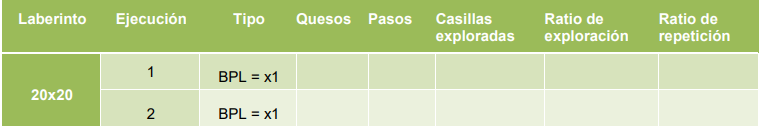

# Actividad 3
## Implementación de un agente que represente la estrategia de búsqueda no informada con profundidad limitada (BPL)

Los estudiantes incorporarán el algoritmo de Búsqueda en *Profundidad Limitada
(BPL)*, estudiado en la parte teórica de la asignatura, y la clase con el ratón se
llamará igual que la del explorador, pero añadiendo el sufijo ```bpl``` antes de la
extensión ```.java```. En la implementación se podrán usar las estructuras de datos
necesarias así como toda la información que el juego facilita al ratón en cada
momento.

**Nota**: No se puede utilizar ninguna función heurística puesto que es una búsqueda
no informada. Es decir, no se debe utilizar información sobre la posición del queso
para calcular una estimación de la distancia de una posición cualquiera a la posición
del objetivo. Sí se puede utilizar la posición del queso como test objetivo

# Actividad 4
## Análisis del comportamiento del agente buscador en un entorno mono-agente y en un entorno multiagente.
El análisis del agente buscador (con búsqueda no informada con profundidad 
limitada) se realizará en dos pasos:

1. Se ejecutará el agente en un entorno mono-agente, es decir, controlando
   que en la carpeta de agentes solo esté el código del agente ```bpl```, y
   considerando diferentes límites de profundidad. En estas condiciones, se
   ejecutarán 3 partidas, con dos posibles límites, ```x1``` y ```x2```, con cada una de
   estas dos configuraciones:
   - **Configuración 1**: 20 x 20 y 150 segundos.
   - **Configuración 2**: 40 x 20 y 300 segundos.
   
   Los resultados se reflejarán en una tabla de este tipo:

    
    

2. Se ejecutará el agente en un entorno multi-agente, es decir, poniendo en la
   carpeta de agentes los agentes de prueba y una copia del agente de
   búsqueda no informada que se ha implementado, con otro nombre. Se
   volverán a ejecutar el mismo número de partidas de cada una de las dos
   configuraciones anteriores. Los resultados se mostrarán en una tabla como
   la anterior (Tabla 2), indicando que se trata del entorno multiagente.
   Se debe analizar, al menos:
- El comportamiento del agente de búsqueda bpl en entorno mono-agente.
- El comportamiento del agente de búsqueda bpl en entorno multi-agente.
- Las dificultades (_si existen_) a las que se enfrenta el agente bpl en entorno
  multiagente y propuestas de solución en su caso.

# Actividad 5
## Implementación de mejoras del agente ```bpl``` en entorno multiobjetivo.
A la vista de los resultados recogidos en las tablas anteriores, proponer y realizar
los cambios necesarios en la implementación del agente de búsqueda no
informada bpl para evitar posibles problemas en entornos multiobjetivo.

Reflejar los resultados de la ejecución de este nuevo agente en una tabla como
las anteriores (ver Tabla 2). Discutir los resultados obtenidos.